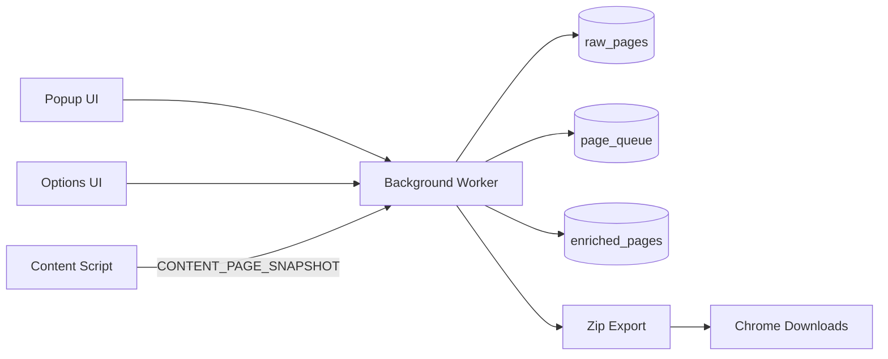

# Recorder

[](https://github.com/gustavo-gardusi/browser-recorder/actions/workflows/ci.yml)
[](https://github.com/gustavo-gardusi/browser-recorder/actions/workflows/ci.yml)
[](https://nodejs.org/)
[](LICENSE)

MVP Chrome extension that records browser tab activity, focused on accumulated page content.

Snapshots are queued, enriched, and exported as a downloadable session zip.

## Features

- Captures accumulated page content after recording starts via fast per-tab polling and close-time flush attempts.
- Produces labeled text chunks (body, same-origin iframes, open shadow roots, semantic labels) for easier downstream parsing.
- Uses a background processing queue to dedupe and enrich snapshots before export.
- Exports a zip with one text file per URL prefix plus metadata.
- Includes quick popup presets and advanced options for filters and storage limits.

## Architecture at a Glance



## Requirements

- Node.js `22.x`
- Chrome/Chromium with Developer Mode enabled for unpacked extensions

## Setup

1. Install dependencies:

```bash
npm install --registry=https://registry.npmjs.org
```

2. Build and print browser loading steps:

```bash
npm run setup:browser
```

3. In Chrome:
   - Open `chrome://extensions`
   - Enable **Developer mode**
   - Click **Load unpacked**
   - Select this repo's `dist/` folder
   - If already loaded, click **Reload**

4. Optional quality checks:

```bash
npm run check
npm run format
npm run format:local
```

## Usage

1. Open extension popup and click **Start**.
2. Recorder starts one polling loop per open tab (default/minimum 100ms), collects labeled text snapshots, and appends new snapshots when content changes.
3. Navigate pages normally in Chrome.
4. Click **Stop** when done.
5. Click **Export Session** to download `recordings/<sessionId>.zip` to your Downloads folder.

You can also click **Clear Session Data** to reset local captured records.

## Common Commands

```bash
npm run dev
npm run test:coverage
npm run lint
npm run typecheck
npm run format:local
```

## Storage and Files

- Capture pipeline data is stored in IndexedDB (`raw_pages`, `page_queue`, `enriched_pages`).
- Recorder enforces a hard size limit and drops new snapshots once the limit is reached.
- Popup offers short capture presets (`Pages only`, `Pages + requests`, `Full capture`).
- Popup has **Open all settings** for advanced filters and hard-limit options (`32/64/128/256/512/1024 MB`, default `32 MB`).
- Export creates a zip in Downloads as `recordings/<sessionId>.zip`.
- Zip contents include:
  - `pages/<urlPrefix>/<safeUrlBasename>.txt` (chronological structured text blocks, one file per full URL nested under prefix folders)
  - `metadata.json` (session id, export timestamp, counts including `urlCount`, summary, per-website stats, embedded `indexText`, settings)
- `src/lib/export.ts` contains an alternate export schema used by dedicated export tests; popup `Export Session` uses the `background.ts` zip contract above.
- Repository includes `recordings/.gitkeep` to reserve a local recordings folder for future shared tooling.

See [`docs/recording-format.md`](docs/recording-format.md) for schema details.
See [`docs/execution-flow.md`](docs/execution-flow.md) for the startup and dedupe execution flow.
For a full runbook to load in Chrome and verify captured results, see [`docs/install-and-verify.md`](docs/install-and-verify.md).

## Privacy Defaults

- URL query params with sensitive key names are redacted in exported page metadata.
- Request URLs are redacted with the same sensitive query-key rules when request capture is enabled.

## MVP Limitations

- Snapshot coverage depends on rendered text availability in the page context.
- Some URLs (for example, `chrome://`) cannot be captured by extension content scripts.
- Export writes to Chrome's download target (not directly to project path) due extension sandboxing.

## Phase 2 (Planned)

- Add optional Native Messaging helper for direct writes to a global shared folder.
- Keep current schema stable for additive evolution.
