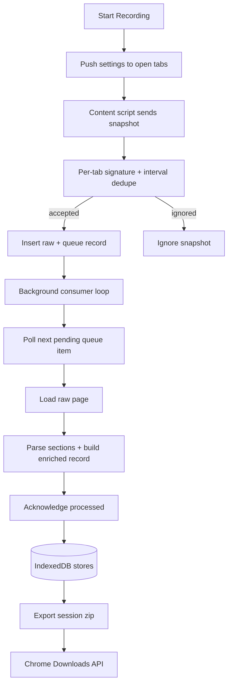

# Recorder Execution Flow

This document describes the capture pipeline from `Start` to export, including per-tab dedupe and the canonical per-URL text export contract.

## Runtime Flow

## Initialization Guarantees

- Recording startup queries current tabs and pushes settings to each capturable tab.
- Recording does not force-capture existing tab state; first snapshot comes from post-start events/polling.
- Content script settings are applied live (for example, poll interval and HTML capture toggle).

## Per-Tab Change Detection

- Content script keeps a lightweight hash loop (`poll-diff`) and lifecycle-triggered snapshots.
- Background keeps authoritative per-tab signature state.
- Snapshots are deduped by hash and minimum poll interval before queue insertion.
- If a new snapshot for a tab has the same signature as the latest accepted one, it is ignored.
- If signature changed, snapshot is accepted and queued for background processing.

## Queue and Persistence Model

- `raw_pages`: incoming raw snapshots.
- `page_queue`: queue items (`pending`, `processing`, `failed`) with retry metadata.
- `enriched_pages`: processed rows used for export and diagnostics.
- Processed count is tracked as an internal metric record.

## Polling Cadence

- Default poll interval is `100ms` (minimum).
- Settings updates are pushed to open tabs and applied without reload.

## Canonical Export Contract

Export writes `recordings/<sessionId>.zip` with:

- `pages/<urlPrefix>/<fullUrl>.txt`
- optional `metadata.json` (enabled by export metadata setting)

Each page text file stores a page-level index header followed by chronological snapshot blocks with fields such as:

- `url`
- `startedAt`, `endedAt`, `durationSeconds`, `snapshotCount`
- aggregate `titles`, `reasons`, `tabIds`, `windowIds`
- `content` (when page text capture is enabled)
- optional flattened `htmlContent` (when HTML capture is enabled)

`metadata.json` includes:

- `sessionId`, `exportedAt`, `pageCount`, `urlCount`
- `summary` and per-prefix `websites` aggregates
- structured `index` and effective `settings`
