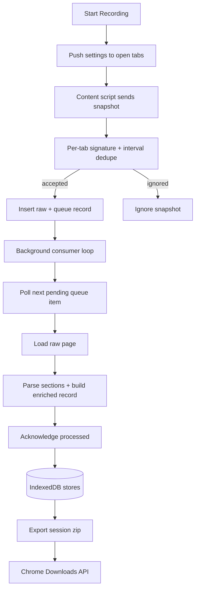

# Recorder Execution Flow

This document describes the capture pipeline from `Start` to export, including per-tab dedupe and the canonical JSONL contract.

## Runtime Flow



## Initialization Guarantees

- Recording startup queries current tabs and pushes settings to each capturable tab.
- Recording does not force-capture existing tab state; first snapshot comes from post-start events/polling.
- Content script settings are applied live (for example, poll interval and HTML capture toggle).

## Per-Tab Change Detection

- Content script keeps a lightweight hash loop (`poll-diff`) and lifecycle-triggered snapshots.
- Background keeps authoritative per-tab signature state.
- Snapshots are deduped by hash and minimum poll interval before queue insertion.
- If a new snapshot for a tab has the same signature as the latest accepted one, it is ignored.
- If signature changed, snapshot is accepted and queued for background processing.

## Queue and Persistence Model

- `raw_pages`: incoming raw snapshots.
- `page_queue`: queue items (`pending`, `processing`, `failed`) with retry metadata.
- `enriched_pages`: processed rows used for export and diagnostics.
- Processed count is tracked as an internal metric record.

## Polling Cadence

- Default poll interval is `300ms`.
- Settings updates are pushed to open tabs and applied without reload.

## Canonical JSONL Snapshot Contract

Export writes `recordings/<sessionId>.zip`, which contains `pages.jsonl`.
Each line in `pages.jsonl` is one enriched snapshot object:

```json
{
  "id": "f4d1747a-4f93-45f2-a8f0-a0e8f91f8cb0",
  "createdAt": "2026-03-28T19:15:11.389Z",
  "timestamp": "2026-03-28T19:15:10.910Z",
  "tabId": 123,
  "windowId": 456,
  "url": "https://app.slack.com/client/E04MEK4FQTF",
  "urlPrefix": "app.slack.com",
  "title": "Slack",
  "reason": "poll-diff",
  "textContent": "Search VTEX ...",
  "htmlContent": "<html>...</html>",
  "sectionCount": 2,
  "contentSizeBytes": 28671
}
```

Notes:

- `textContent` exists when page text capture is enabled.
- `htmlContent` exists when HTML capture is enabled.
- `sectionCount` reflects parser output count used by diagnostics.
