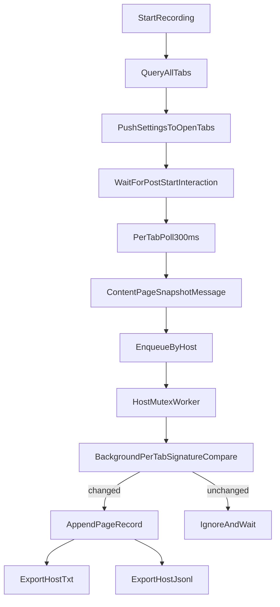

# Recorder Execution Flow

This document describes the capture pipeline from `Start` to export, including per-tab dedupe and the canonical JSONL snapshot contract.

## Runtime Flow



## Initialization Guarantees

- Recording startup queries current tabs and pushes settings to each capturable tab.
- Recording does not force-capture pre-open tabs; first append comes from post-start interactions/changes.
- Tab messaging tries direct `tabs.sendMessage`; if missing content script, it injects `content.js` and retries.

## Per-Tab Change Detection

- Content script keeps a lightweight hash loop (`poll-diff`) and lifecycle-triggered snapshots.
- Background keeps authoritative per-tab signature state.
- Background queues snapshots per host and processes one append worker per host (mutex semantics).
- If a new snapshot for a tab has the same signature as the latest accepted one, it is ignored.
- If signature changed, snapshot is appended and becomes the new tab baseline.

## Host File Index and Export Locking

- Background keeps a host index in storage (`recorder:host-index`) to track active URL-host files.
- Export uses one active lock per session and overwrites target files to avoid `host (1).txt` duplicates.

## Polling Cadence

- Default poll interval is `300ms`.
- Settings updates are pushed to open tabs and applied without reload.

## Canonical JSONL Snapshot Contract

Each host exports `recordings/<sessionId>/pages/<host>.jsonl`.
Each line is one snapshot object:

```json
{
  "sessionId": "2026-03-28T19-15-09.786Z_ab12cd34",
  "timestamp": "2026-03-28T19:15:11.389Z",
  "tabId": 923579348,
  "windowId": 923579207,
  "url": "https://app.slack.com/client/E04MEK4FQTF",
  "title": "Slack",
  "reason": "poll-diff",
  "sections": [
    { "title": "Threads", "lines": ["Huddles", "Drafts & sent"] },
    { "title": "Messages", "lines": ["Yesterday at 3:49 PM"] }
  ],
  "text": "Search VTEX ...",
  "html": "<html>...</html>"
}
```

Notes:

- `sections` is sanitized and stable for LLM parsing.
- `text` exists when page-text capture is enabled.
- `html` exists when html capture is enabled.
- `.txt` exports remain available for human-readable inspection.
