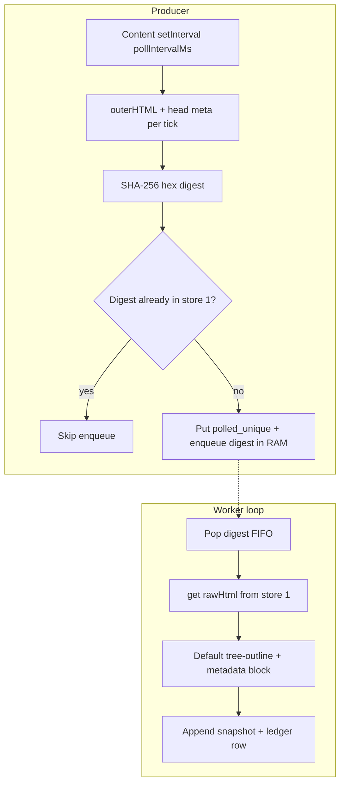

# Recorder execution flow (v1)

End-to-end behavior from **Start** through **Stop**, processing, and **Export**.

## High-level pipeline

## Timer-only polling

The content script runs on an interval (configured in **Options**, clamped ≥ 100 ms). Each tick it sends **`RECORDER_CAPTURE`** with full `document.documentElement.outerHTML` and extracted `<head>` metadata. There are **no** click/key/navigation-driven capture triggers in v1.

When you click **Start**, the background broadcasts **`RECORDER_RECORDING`** (with `pollIntervalMs`) to open tabs so each injected content script starts or updates its timer. **Stop** clears that recording flag so polling stops.

## Dedupe and stores

1. Compute **SHA-256** (hex) of the UTF-8 HTML string.
2. If **`polled_unique`** already has that digest, **do not** enqueue again (duplicate suppressed for that poll).
3. Otherwise **put** store 1 row (includes full `rawHtml`) and **push** digest to the **in-memory FIFO**.

The worker pops digests, reads `rawHtml`, builds one snapshot **`text`** string, appends `{ id, text }` to **`processed_by_url`**, and inserts a **`snapshot_ledger`** row (`seq`, `snapshotId`, `fullUrl`, `bytesEstimate`, …).

## Stop

**Stop** disables capture broadcasts, drains/flushes the digest worker, clears the **RAM digest queue**, and **clears store 1** (`polled_unique`). Stores **2 and 3** (processed + ledger) remain so exports still work.

## Export

**Export** is allowed only when **not** recording. The background builds a zip (see **[recorder-recording-format.md](recorder-recording-format.md)**) and triggers a **single-file** download into Downloads.

## Clear (popup)

When stopped, **Clear…** opens a modal:

- **Trim old** — walks the **ledger** in order and deletes oldest snapshots until estimated stores **2+3** size is under **targetAfterCleanupMb** from Options.
- **Clear all** — wipes stores 1–3 and the digest queue (full reset of persisted session data).

## Force stop (size limit)

When estimated **total** IndexedDB usage (stores 1+2+3) exceeds **limitForceStopMb**, recording is **force-stopped**, state flags **`forceStoppedForLimit`**, and the same cleanup path as Stop runs on the raw side (queue + store 1). Use **Trim old** / **Export** after reviewing usage.

## Related

- Export layout: **[recorder-recording-format.md](recorder-recording-format.md)**.
- Local verification: **[recorder-install-verify.md](recorder-install-verify.md)**.
