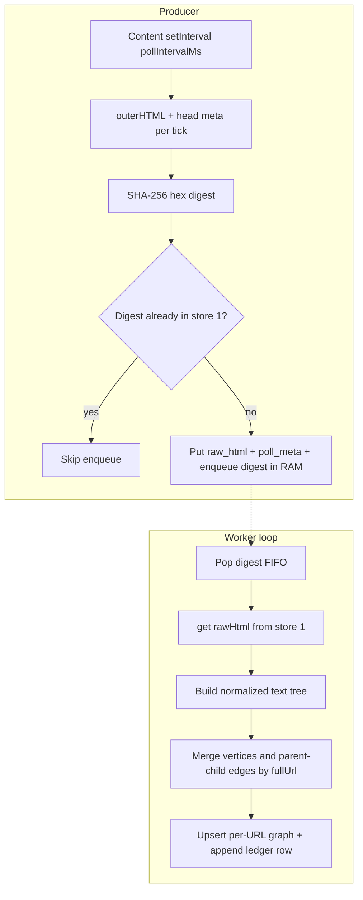

# Recorder execution flow (v1)

End-to-end behavior from **Start** through **Stop**, processing, and **Export**.

## High-level pipeline

## Timer-only polling

The content script runs on an interval (configured in **Options**, clamped ≥ 100 ms). Each tick it sends **`RECORDER_CAPTURE`** with full `document.documentElement.outerHTML` and extracted `<head>` metadata. There are **no** click/key/navigation-driven capture triggers in v1.

When you click **Start**, the background broadcasts **`RECORDER_RECORDING`** (with `pollIntervalMs`) to open tabs so each injected content script starts or updates its timer. **Stop** clears that recording flag so polling stops.

## Dedupe and stores

1. Compute **SHA-256** (hex) of the UTF-8 HTML string.
2. If that digest already exists in **`poll_meta_by_digest`** / **`raw_html_by_digest`**, **do not** enqueue again (duplicate suppressed for that poll).
3. Otherwise **put** the raw + metadata rows (includes full `rawHtml`) and **push** digest to the **in-memory FIFO**.

The worker pops digests, reads `rawHtml`, converts it to a normalized text tree, then merges that tree into one graph keyed by `fullUrl`:

- **Vertices** are deduped by stable node keys (parent, depth, sibling index, tag/role/text).
- **Edges** preserve parent → child nesting.
- `processed_by_url` stores one merged graph per URL (`vertices` + `childrenByParent`).
- `snapshot_ledger` still appends one row per ingest (`seq`, `snapshotId`, `fullUrl`, `bytesEstimate`, …) for trim order and usage estimates.

Detailed schema and examples: **[recorder-merged-graph-schema.md](recorder-merged-graph-schema.md)**.

The popup label **Ingests** counts **ledger rows** (one per successful digest processed into the graph), not the number of unique vertices.

## Stop

**Stop** disables capture broadcasts, drains/flushes the digest worker, clears the **RAM digest queue**, and **clears the raw IndexedDB rows** (`raw_html_by_digest`, `poll_meta_by_digest`). **Processed output** (`processed_by_url`), the **ledger** (`snapshot_ledger`), and sidecar stores remain so exports still work.

## Export

**Export** is allowed only when **not** recording. The background builds a zip (see **[recorder-recording-format.md](recorder-recording-format.md)**) and triggers a **single-file** download into Downloads.

## Clear (popup)

When stopped, **Clear…** opens a modal:

- **Clear old** — walks the **ledger** in order and removes vertices introduced by the oldest ingests until estimated stores **2+3** (output) size is about **half** what it was before the operation.
- **Clear all** — wipes stores 1–3 and the digest queue (full reset of persisted session data).

## Force stop (size limit)

While recording, if estimated **output** size exceeds **limitForceStopMb** (same estimate as **Output** in the popup: merged graphs in `processed_by_url`, **`snapshot_ledger`**, plus **`site_metadata_lines`** and **`site_request_log`**), recording is **force-stopped**, state flags **`forceStoppedForLimit`**, and the same cleanup path as Stop runs on the raw side (queue + store 1). Raw HTML is **not** included in that limit check. Use **Clear old**, **Clear all**, or **Export** after reviewing usage.

**Start** is blocked when **Output** is already at or above the limit (see Options).

## Related

- System design (components, metrics, diagrams): **[recorder-system-design.md](recorder-system-design.md)**.
- Export layout: **[recorder-recording-format.md](recorder-recording-format.md)**.
- Local verification: **[recorder-install-verify.md](recorder-install-verify.md)**.
