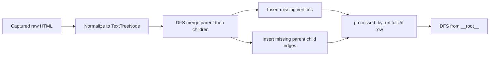
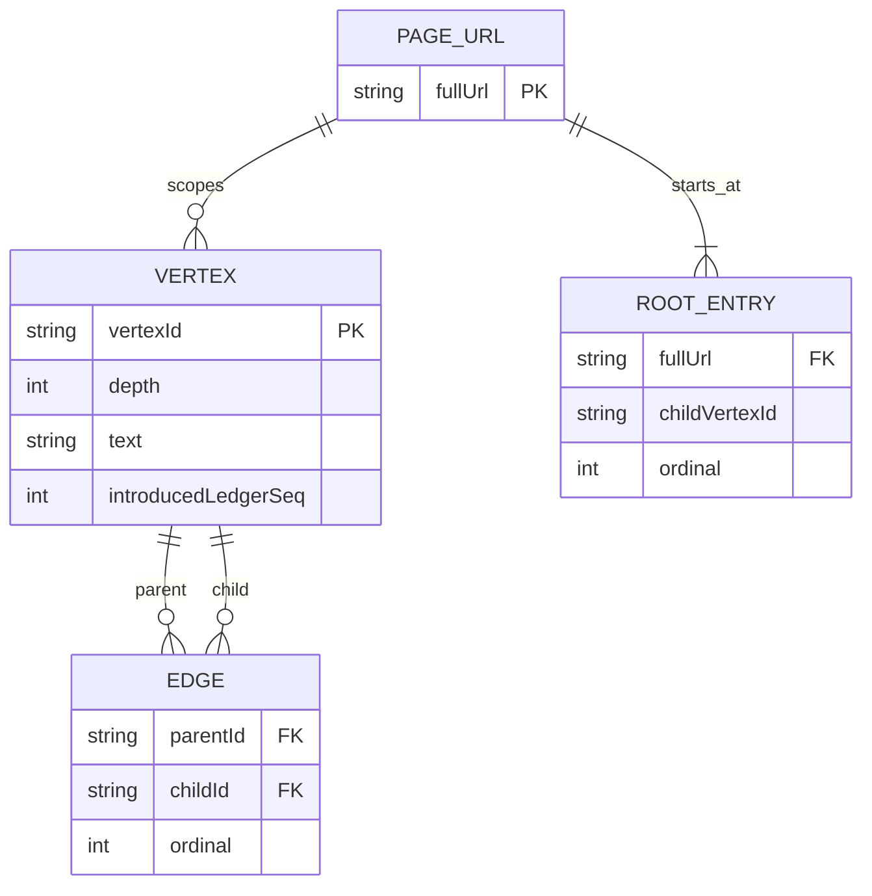

# Recorder merged graph schema

This page describes how recorder output is stored after the per-URL tree merge refactor.

For the full runtime picture (tabs, service worker, queue, tools), see **[recorder-system-design.md](recorder-system-design.md)**.

## Goal

Avoid storing duplicate snapshot trees when the same page is polled repeatedly (for example, Slack while scrolling).  
Each new capture contributes only unseen nodes/edges to a graph keyed by `fullUrl`.

## Logical tables

| Logical table      | Key                   | Fields                                                  | Notes                                                                                        |
| ------------------ | --------------------- | ------------------------------------------------------- | -------------------------------------------------------------------------------------------- |
| URL graph registry | `fullUrl`             | `rootChildVertexIds`                                    | `rootChildVertexIds` is stored as `childrenByParent["__root__"]`.                            |
| Vertices           | `vertexId`            | `depth`, `text`, `tag?`, `role?`, `introducedLedgerSeq` | `vertexId` is a stable hash from parent context + node details (no sibling index).           |
| Edges              | `(parentId, childId)` | `ordinal`                                               | Logical-only field; physically, ordinal is each child index in `childrenByParent[parentId]`. |
| Ledger             | auto `seq`            | `snapshotId`, `fullUrl`, `createdAt`, `bytesEstimate`   | One row per ingest for trim order and storage estimates.                                     |

## Physical IndexedDB shape

Database name: **`recorder-idb`** (version bumps may wipe incompatible processed/ledger data; see extension upgrade path in code).

The recorder keeps one row per URL in object store **`processed_by_url`** (key: `fullUrl`).

```ts
type ProcessedByUrlRecord = {
  fullUrl: string;
  graph: {
    vertices: Record<
      string,
      {
        depth: number;
        text: string;
        tag?: string;
        role?: string;
        introducedLedgerSeq: number;
      }
    >;
    childrenByParent: Record<string, string[]>; // "__root__" starts DFS
  };
};
```

## Merge behavior

1. Poll capture arrives and dedupes by digest in store 1.
2. Worker builds `TextTreeNode` (`htmlToTextTree` + `compressTextTree`).
3. Worker runs DFS:
   - Parent is known for the current node.
   - Create/lookup `vertexId` from fingerprint tuple:
     - `parentVertexId`
     - `depth`
     - `tag`, `role`, normalized `text`
     - `parentTag`, `parentRole`, `parentTextHash`
     - `ancestorTagTrail` (last K ancestor tags, joined with `>`)
   - Add edge `parentId -> childId` if missing.
   - Recurse to children.
4. Upsert URL graph row and append ledger row with the same ingest sequence.



## Worked example

### First poll (`seq=1`)

Input tree (simplified):

```text
Thread
  hello
```

Result:

| Vertices  | Value                                                  |
| --------- | ------------------------------------------------------ |
| `vThread` | `{ depth: 0, text: "Thread", introducedLedgerSeq: 1 }` |
| `vHello`  | `{ depth: 1, text: "hello", introducedLedgerSeq: 1 }`  |

| Edges                 | Value     |
| --------------------- | --------- |
| `__root__ -> vThread` | ordinal 0 |
| `vThread -> vHello`   | ordinal 0 |

### Second poll (`seq=2`)

Input tree:

```text
Thread
  hello
  new message
```

Merge result:

- `vThread` already exists (same key) -> not duplicated.
- `vHello` already exists -> not duplicated.
- new vertex `vNewMessage` inserted with `introducedLedgerSeq: 2`.
- new edge `vThread -> vNewMessage` appended at next ordinal.
- If DOM sibling order changes on a later poll (for example, same message moves from 5th to 10th position), keys still match because sibling index is not part of the fingerprint.

## Fingerprint tuple (v1)

`vertexId` is generated by `sha256Hex(JSON.stringify(tuple))` where tuple fields are:

1. `FINGERPRINT_VERSION`
2. `parentVertexId`
3. `depth`
4. `tag`
5. `role`
6. `normalizedText`
7. `parentTag`
8. `parentRole`
9. `parentTextHash`
10. `ancestorTagTrail`

This keeps dedupe reorder-safe while still scoped by parent path/context.

## Trim behavior (`Clear old`)

Given oldest ledger `seq = S`:

1. Remove vertices with `introducedLedgerSeq === S`.
2. Remove those vertex ids from every `childrenByParent` list.
3. If a URL graph has no vertices left, delete that URL row.

This keeps output consistent while deleting oldest contributions first.

## Export behavior

Export does not rebuild from raw HTML. It reads merged graphs and emits DFS text:

- Start nodes: `childrenByParent["__root__"]`.
- Traversal: pre-order DFS.
- Formatting: tabs by depth (`"\t".repeat(depth)`).



`EDGE` and `ROOT_ENTRY` are logical views; physically they are represented by ordered arrays in `childrenByParent`.

## Migration note

When fingerprint tuple fields change, previously stored `vertexId` values become incompatible. The extension bumps DB version and clears processed graph + ledger stores during upgrade for this class of change.
