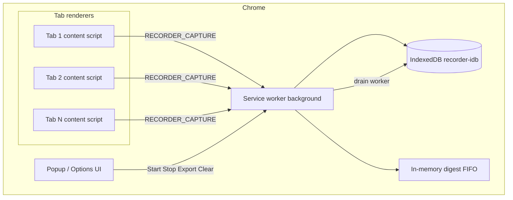
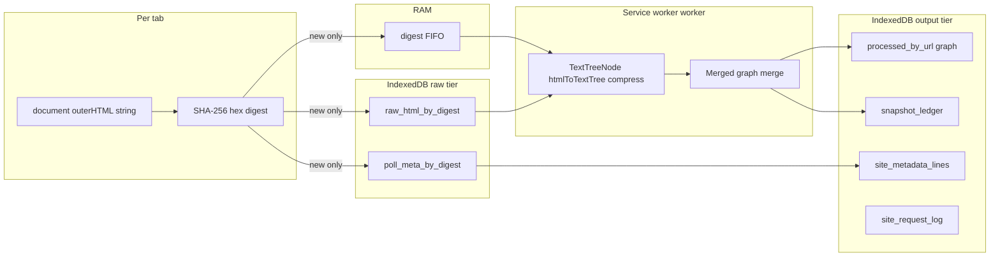

# Recorder — system design

This page is a **single place** for how the Recorder extension is put together: runtime pieces in Chrome, data motion, storage, and rough sizing intuition. For export file layout and IndexedDB field detail, see **[recorder-recording-format.md](recorder-recording-format.md)** and **[recorder-merged-graph-schema.md](recorder-merged-graph-schema.md)**.

## Tooling and repo stack

| Layer              | What we use                                                                                                                                          |
| ------------------ | ---------------------------------------------------------------------------------------------------------------------------------------------------- |
| Language / build   | **TypeScript**, **Vite** (bundles `background`, `content`, `popup`, `options` into `extensions/recorder/dist/`)                                      |
| Tests / quality    | **Vitest** (unit + jsdom), **ESLint**, **Prettier**, `tsc --noEmit`                                                                                  |
| Extension platform | **Chrome MV3** — `manifest_version` 3, **service worker** background, **content scripts**, `chrome.storage.local`, **`chrome.downloads`** for export |
| Persistence        | **`indexedDB`** (`recorder-idb`) for capture + output; in-memory **FIFO** for pending work                                                           |

Chrome APIs in play: **`chrome.runtime`** (messaging), **`chrome.tabs`** + **`chrome.scripting`** (broadcast / inject), **`chrome.storage.local`** (settings + session flags), **`chrome.webRequest`** (optional request summaries per origin), **`chrome.downloads`** (zip export).

## Chrome runtime model (why “every tab” matters)

Chrome is **multiprocess**. A **tab’s page** usually runs in a **renderer process** (often one process per tab, or grouped by site with site isolation). The extension **service worker** runs in a **separate** process and can wake, sleep, and restart independently of tabs.

- **Content scripts** (`content.js`) are injected into **normal `http(s)` pages** and share the page’s renderer. Each tab that has a capturable page runs its **own** timer-driven poll; there is no shared thread across tabs.
- **Background** (`background.js`) is the **single** coordinator: it receives captures from any tab, writes **IndexedDB**, and runs the **digest worker** (FIFO drain) so processing stays ordered and serial.

So: many tabs ⇒ many independent polls ⇒ more `RECORDER_CAPTURE` messages and potentially more distinct URLs and digests feeding the same DB and queue.

## High-level architecture

**Sequence (recording on):**

1. User starts recording → background broadcasts **`RECORDER_RECORDING`** to tabs (and may inject `content.js` if needed).
2. Each content script uses **`setInterval(pollIntervalMs)`** (clamped in Options) to read **`document.documentElement.outerHTML`** plus head-derived metadata, then sends **`RECORDER_CAPTURE`** to the service worker.
3. Background computes **SHA-256** of the HTML. If that digest is **new**, it writes **raw + metadata** rows to IndexedDB and **enqueues the digest** in the RAM FIFO.
4. The **worker loop** pops digests **FIFO**, loads raw HTML, builds a **text tree**, **merges** into per-URL graphs, appends a **ledger** row, and updates **site metadata** lines when applicable.
5. **Stop** clears the FIFO and **raw** stores; **merged output + ledger** remain for export.

## Low-level data path (raw → queue → worker → tables)

**Payload shapes (conceptual):**

| Stage         | Main payload                                                                         | Notes                                                                          |
| ------------- | ------------------------------------------------------------------------------------ | ------------------------------------------------------------------------------ |
| Capture       | Full **`outerHTML` string**, URL, title, tab/window ids, optional head meta          | Large; deduped by digest.                                                      |
| Queue         | **Digest hex** only                                                                  | Tiny; ordering = ingest order for that session.                                |
| Worker output | **`MergedTextGraph`** per `fullUrl` (`vertices`, `childrenByParent` with `__root__`) | Grows with **new** nodes/edges, not full duplicate trees.                      |
| Ledger        | One row per processed digest with **byte delta** estimate                            | Drives **Clear old** (drop oldest ingests’ vertices by `introducedLedgerSeq`). |

## Database “tables” (object stores)

Logical view — physical store names are in **`extensions/recorder/src/lib/db.ts`**:

| Store                 | Key        | Purpose                                          |
| --------------------- | ---------- | ------------------------------------------------ |
| `raw_html_by_digest`  | digest     | Full HTML blob for worker.                       |
| `poll_meta_by_digest` | digest     | URL, title, times, ids, head meta (no raw body). |
| `processed_by_url`    | `fullUrl`  | Merged graph for export.                         |
| `snapshot_ledger`     | auto `seq` | Ingest history + size hints for trim.            |
| `site_metadata_lines` | origin     | Deduped metadata lines (titles, links, etc.).    |
| `site_request_log`    | origin     | Recent redacted request lines (cap per origin).  |

## Metrics and growth (how things behave “right now”)

**Sampling frequency**

- Default **`pollIntervalMs`**: **500 ms** (Options clamp **100–5000 ms**).
- **Per tab**: each injected content script maintains its **own** interval. Ten active tabs ≈ up to ten times the capture attempts per wall-clock second (subject to timer throttling when tabs are in background).

**What drives IndexedDB size**

| Factor                     | Effect                                                                                                                                                                               |
| -------------------------- | ------------------------------------------------------------------------------------------------------------------------------------------------------------------------------------ |
| **Distinct pages / URLs**  | One **`processed_by_url`** row per `fullUrl`; graphs merge across time for that URL.                                                                                                 |
| **Distinct HTML per poll** | Raw tier grows only on **new digest** (identical `outerHTML` is skipped). Scrolling or dynamic DOM ⇒ new digests ⇒ more raw rows + more ledger rows + graph growth for new vertices. |
| **Duplicate-heavy pages**  | Merge model means **repeated subtrees** add little to **`vertices`** after the first time; you still pay **ledger + raw** for each new digest unless HTML is byte-identical.         |
| **Sidecars**               | `site_metadata_lines` and `site_request_log` add bounded / merged overhead per origin.                                                                                               |

**Limits (defaults)**

- **`limitForceStopMb`**: default **32 MB** (Options range **8–2048 MB**).
- **Force-stop check** applies to **output estimate** (`estimateBytesStores23`): processed graphs + ledger + site metadata + request logs — **not** the transient raw tier during a burst before stop clears it.
- **Start blocked** when output is already ≥ configured limit until **Clear old** / **Clear all** reduces it.

**Order-of-magnitude text**

- There is **no fixed “chars per page”** in code: it depends on DOM size. A practical bound is the **configured output cap**; the **merged `.txt` export** is usually **much smaller** than raw HTML because the pipeline strips scripts/styles and collapses structure, but pathological pages can still grow large graphs.

## Numeric examples (illustrative)

The extension does **not** enforce a tab limit or a “max pages” cap. Numbers below are **rough intuition** so you can plan; real usage depends on DOM size, how often HTML changes, and sidecar volume.

### How many tabs to keep open (recommendation)

| Profile                 | Open `http(s)` tabs (ballpark) | Why                                                                                                                                                            |
| ----------------------- | ------------------------------ | -------------------------------------------------------------------------------------------------------------------------------------------------------------- |
| **Focused capture**     | **1–3**                        | Lowest overlap noise, easiest to reason about storage and export.                                                                                              |
| **Normal multitasking** | **4–8**                        | Still manageable; watch **Output** in the popup and raise **poll interval** if needed.                                                                         |
| **Heavy / many sites**  | **10+**                        | Each tab polls independently; background work and IndexedDB growth scale up. Background timers may **throttle** inactive tabs, but active tabs still add load. |

There is **no “recommended maximum” in code**—if you need many tabs, increase **poll interval** (e.g. 1000–2000 ms) or **output limit** (Options), and use **Clear old** between long sessions.

### How many distinct pages (URLs) to expect

- **Output rows**: you get **at most one** `processed_by_url` row per **distinct `fullUrl` string** that has produced at least one successful ingest during the life of that data (until **Clear all**).
- **Same page, different query or hash** → **different** `fullUrl` → **another** row (e.g. `…/inbox` vs `…/inbox?thread=1` are two keys).
- **Lower bound**: if you only ever visit one URL while recording, expect **1** row regardless of poll count.
- **Upper bound (practical)**: about the number of **unique navigations** you actually hit while recording, not “tabs open” (a tab can visit many URLs over time).

### Poll rate vs tab count (before dedupe)

Let **`T`** = number of capturable tabs (normal `https://` pages with content script running), **`P`** = `pollIntervalMs` / 1000.

**Theoretical ceiling** of poll _attempts_ per minute (every tab fires every tick; ignores identical HTML):

\[
\text{attempts/min} \approx T \times \frac{60}{P}
\]

Examples with default **500 ms** (`P = 0.5`):

| Tabs `T` | Attempts/min (upper ceiling) |
| -------- | ---------------------------- |
| 1        | ~120                         |
| 3        | ~360                         |
| 5        | ~600                         |
| 10       | ~1200                        |

**Reality**: many attempts produce the **same digest** (unchanged `outerHTML`), so **IndexedDB and the queue only grow on _new_ digests**. A static page might contribute **one** ingest per recording segment even with hundreds of polls.

### Output size vs ingests (very rough)

Force-stop and the **Output** meter use an **estimated byte size** of merged graphs + ledger + sidecars (see code: `estimateBytesStores23`). That is **not** “raw HTML bytes”.

Illustrative only—pick numbers that match _your_ sites if you calibrate once:

- Suppose average **incremental growth** of stored output per new digest is **~15–80 KiB** (small page / heavy page after merge and JSON overhead).
- Default cap **32 MiB** ≈ **32 768 KiB** → ballpark **400–2000+ ledger ingests** before you hit the limit, depending on page weight and how much the merge dedupes.

**Merged text export** is often **smaller per vertex** than raw HTML, but **ledger + graph JSON** still accumulates per ingest.

### Three concrete scenarios

| Scenario                        | Tabs | Behavior                                      | Distinct `fullUrl` rows (typical) | Ingest / growth feel                                                   |
| ------------------------------- | ---- | --------------------------------------------- | --------------------------------- | ---------------------------------------------------------------------- |
| **A. Single static doc**        | 1    | HTML identical every poll                     | **1**                             | Very few ingests; graph stabilizes quickly.                            |
| **B. One chat / feed (scroll)** | 1    | New HTML often → new digest                   | **1**                             | Many ingests into **one** graph; vertices grow with **new** UI chunks. |
| **C. Research: 4 sites**        | 4    | Each tab mostly one origin, little navigation | **4** (until you follow links)    | Output scales with **four** graphs + **sum** of scroll churn on each.  |

### While recording: raw tier spike

Before **Stop**, **new digests** also write **full raw HTML** (two object stores). If many unique snapshots arrive fast, **disk + worker queue** can spike even if **output** is still under the force-stop limit—**Stop** clears raw; only output remains.

## Related diagrams elsewhere

- Pipeline steps: **[recorder-execution-flow.md](recorder-execution-flow.md)**
- Graph merge + trim detail: **[recorder-merged-graph-schema.md](recorder-merged-graph-schema.md)**
