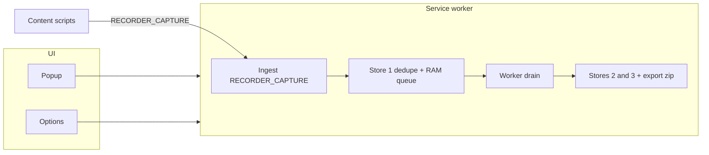

# Recorder

[](https://github.com/gardusig/chrome-extensions/actions/workflows/ci.yml)
[](https://nodejs.org/)
[](../../LICENSE)

Chrome extension (MV3) that **samples open tabs on a timer**, dedupes captures by **SHA-256** of the full HTML, stores raw HTML in IndexedDB, merges captures into a **per-URL text graph** (deduped vertices + parent/child edges), and lets you **export** a zip when recording is **stopped**.

## Documentation

All docs live in the repo **`docs/`** folder (not here):

| Topic                           | Link                                                                               |
| ------------------------------- | ---------------------------------------------------------------------------------- |
| System design                   | [docs/recorder-system-design.md](../../docs/recorder-system-design.md)             |
| Build & load unpacked           | [docs/local-development.md](../../docs/local-development.md)                       |
| Store publish & profile install | [docs/chrome-web-store-release.md](../../docs/chrome-web-store-release.md)         |
| Export zip layout               | [docs/recorder-recording-format.md](../../docs/recorder-recording-format.md)       |
| Merged graph schema             | [docs/recorder-merged-graph-schema.md](../../docs/recorder-merged-graph-schema.md) |
| Pipeline behavior               | [docs/recorder-execution-flow.md](../../docs/recorder-execution-flow.md)           |
| Smoke test                      | [docs/recorder-install-verify.md](../../docs/recorder-install-verify.md)           |
| Doc index                       | [docs/README.md](../../docs/README.md)                                             |

## Requirements

- Node.js **22.x**
- Chrome with **Developer mode** for unpacked loads

## Build (from repository root)

```bash
npm ci
npm run build
```

Load **`extensions/recorder/dist/`** in `chrome://extensions` → **Load unpacked**.

Or run `npm run setup:browser` for copy-paste instructions after a build.

## Usage

1. **Options** — poll interval (ms), force-stop limit for **output** (MB).
2. Popup — **Start** / **Stop**; **Export** and **Clear…** are enabled only when **not** recording.
   - If the recorder was force-stopped for size, Start stays disabled until output drops under the configured limit.
   - **Clear…** offers **Clear old** (~half current output) or **Clear all**.
3. Export downloads `recorder-session-YYYY-MM-DDTHH-mm-ss.zip` (UTC timestamp) into Downloads.

### Storage behavior

- Force-stop checks stores **2+3** only (output graph + ledger).
- Store **1** (`polled_unique`, raw HTML queue) is cleared when recording stops.
- After stop, output remains available for export or **Clear old** / **Clear all**.

### Metadata additions

- `page_metadata` can include:
  - `relatedLinks`: redacted links extracted from snapshot HTML (`a[href]`).
  - `requests`: recent tab-scoped request summaries (`method`, `status`, payload/response size when available, content-types).

## Architecture (conceptual)



## Development commands

From the repository root:

```bash
npm run test
npm run lint
npm run typecheck
npm run check
```

## Privacy

Captured content stays **local** (IndexedDB + extension storage) unless you copy exports elsewhere. Describe your own retention policy if you publish to the Chrome Web Store.
